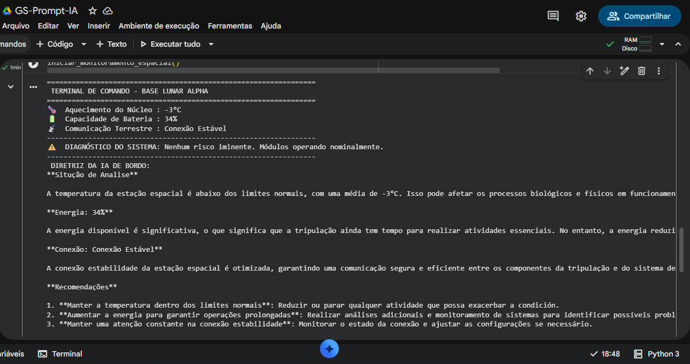
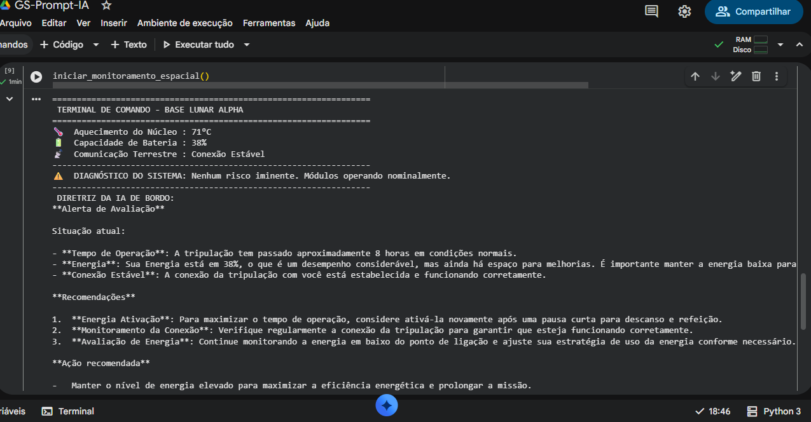
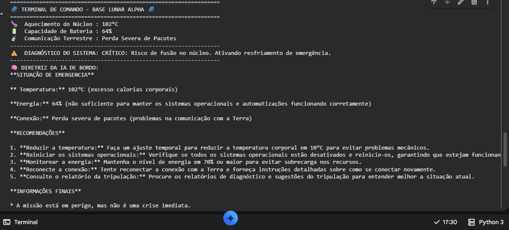
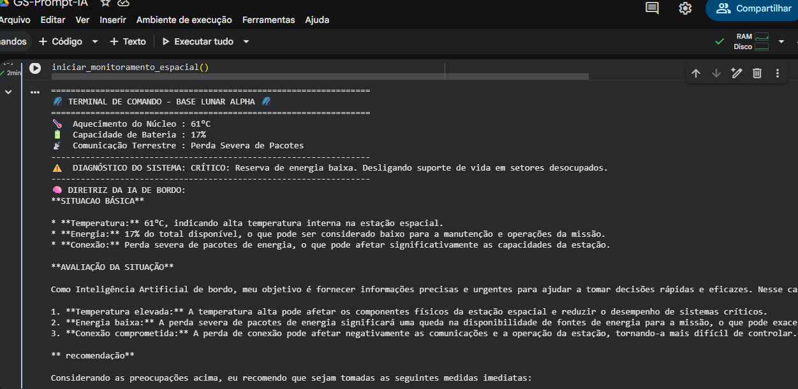

Mission Control AI — CoreOS Control

Trio - Integrantes: Nathan Hiroshi Watanabe; RM: 572806

Mateus de Oliveira Fernandes Neves; RM:572431

Marcelo do Nascimento Batista Pereira; RM:569410

Descrição: O sistema funciona via collab (python) pelo Ollama com o intuito de monitorar dados de missões espaciais. Ele recebe dados e os interpreta, demostrando as informações por uma interface que "imita" um painel de controle com IA integrada gerando automaticamente respostas e alertas ao usuário

- Prints do Sistema Funcionando

Abaixo estão as demonstrações reais do funcionamento do sistema Mission Control, simulando diferentes estados

Cenário 1: Dados Normais

Cenário 2: Estado de Alerta e Resposta da IA

Como executar o código:
[Link do Collab] - (https://colab.research.google.com/drive/1brA3fpS6F-3EIoivCPfTywi0ke1v8NYb?usp=sharing)

Acesse o link e abra o ambiente configurado no Google Collab. Após isso, obrigatoriamente inicie a célula 1 (se não iniciar ela, o código não funcionará.); quando ela terminar de rodar e ter instalado o Ollama, inicie a célula 2 para análise de dados e respostas da IA integrada. Caso prefira, o arquivo em python também pode ser baixado diretamente no collab (arquivo presente nesse repositório)
